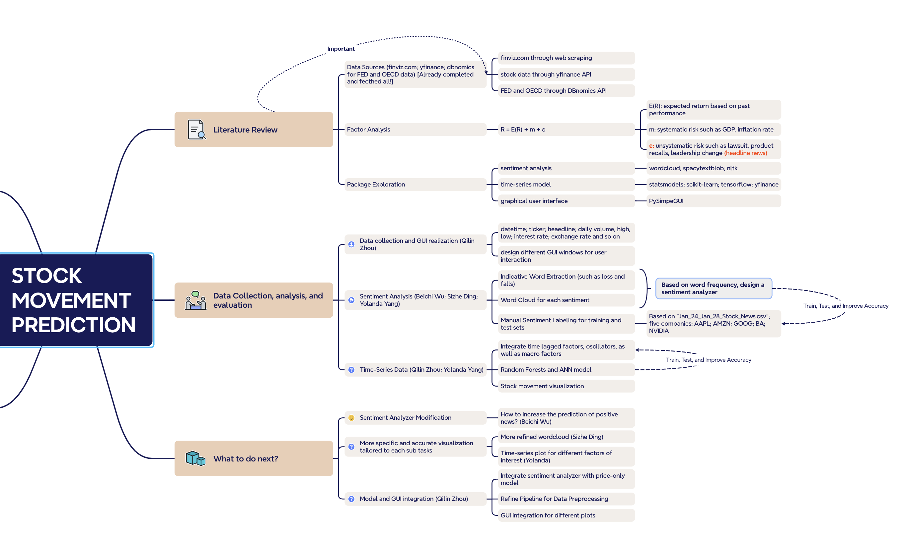

# 📈 S&P 500 Stock Movement Prediction

## 🌟 Overview
This repository hosts the code 🧑‍💻 and documentation 📄 for a machine learning project aimed at predicting stock market movements. We use various data sources 📊, factor analysis 🔍, and machine learning techniques 🤖, including sentiment analysis and time-series forecasting.

## 📚 Table of Contents
- [Literature Review](#literature-review)
- [Package Exploration](#package-exploration)
- [Data Collection, Analysis, and Evaluation](#data-collection-analysis-and-evaluation)
- [Factor Analysis](#factor-analysis)
- [Development Process](#development-process)



## 📖 Literature Review
A thorough investigation of existing research on stock movement prediction methodologies.

## 🔎 Package Exploration
Examination of various Python libraries 🐍 for data analysis and machine learning.
1. Data Science and Analysis: pandas, numpy, matplotlib, seaborn, plotly, kaleido
2. Machine Learning and Data Processing: scikit-learn, tensorflow, scikeras, joblib
3. Natural Language Processing: textblob, en_core_web_sm
4. Financial Data Analysis: yfinance, fredapi
5. Web Scraping: requests
6. Visualization and User Interface: PySimpleGUI, wordcloud 

## 🗂️ Data Collection, Analysis, and Evaluation
Details the data sources and analytical methods used in the project.

### 🛠️ Data Sources
- **Headline News**: Scraped from finviz 📈 https://finviz.com/.
- **Stock Data**: Collected through Yahoo Finance API 📈.
- **Economic Indicators**: Fetched from DBnomics API and Federal Reserve Economic Data API for macro-economic factor analysis 🌐.

## 📈 Factor Analysis
Explores the relationship between expected returns and systematic risk.
- **Sentiment Analysis**: Implemented to understand market sentiment's impact on stock movements 💬.
- **Time-Series Data**: Analyzed to capture patterns and trends over time ⏳.

## ❓ What to Do Next?
Outlines the forthcoming steps in the project's lifecycle

## How to Use?
### 1.1 File Structure
```python
sp500
    compile
        __init__.py
        cleanup.py
        pos.py
    headlines
        __init__.py
        app.py
        displayer.py
        scraper.py
    sa
        data
        __init__.py
        analyzer.py
        sa.py
        test.py 
        train_classifier.py
    time_series
        visualization
            best_model_viz.py
            company_profile.py
            macro_indicators_viz.py
            stock_movement.py
        price_model.py
        time_series_preprocessing.py
    visualization
        visualization
        __init__.py
        create_word_clooud.py
        datatypes.py
        wordcloud_in_logo.py
poetry.lock
pyproject.toml
README.md

```
<<<<<<< HEAD
### 1.2 Instruction
This guide outlines how to configure and run our TensorFlow model GUI using Anaconda and Poetry, focusing on compatibility with Python versions supported by TensorFlow (<3.12).

**Prerequisites**
Anaconda and Poetry installed on your system.

1. Verify Anaconda's Python Installation
```shell
which python
```
2. Configure Poetry to Use Anaconda's Python 
```shell
poetry env use /path/to/anaconda3/bin/python
```
3. Installing Dependencies
```shell
poetry install
```
4. Running the GUI
```shell
poetry run python sp500/headlines/app.py
```
=======


### 1.2 User Instruction
1. Clone repository ```git clone git@github.com:qilinzho56/SP500.git``` in terminal
2. Run ```pip install --user -U nltk``` in terminal
3. Run ```poetry install``` to install necessary packages in terminal
4. Activate virtual environment by running ```poetry shell``` in terminal
5. Run the command line ```poetry run python sp500/headlines/app.py``` in terminal to interact with our application
    If you are using a Mac with an M1, you may encounter tensorflow installation problems (zsh: illegal hardware instruction). Please refer to https://stackoverflow.com/questions/65383338/zsh-illegal-hardware-instruction-python-when-installing-tensorflow-on-macbook 
>>>>>>> 7ea883151d4a007deda4336e38c760ff7f046bb4


## Reference
- D. Shah, H. Isah and F. Zulkernine, "Predicting the Effects of News Sentiments on the Stock Market," 2018 IEEE International Conference on Big Data (Big Data), Seattle, WA, USA, 2018, pp. 4705-4708.
- Hutto, C.J. & Gilbert, E.E. (2014). VADER: A Parsimonious Rule-based Model for Sentiment Analysis of Social Media Text. Eighth International Conference on Weblogs and Social Media (ICWSM-14). Ann Arbor, MI, June 2014.
- Loughran, T. and McDonald, B. (2011), ``When Is a Liability Not a Liability? Textual Analysis, Dictionaries, and 10-Ks.'' The Journal of Finance, 66: 35-65.
- S. Mohan, S. Mullapudi, S. Sammeta, P. Vijayvergia and D. C. Anastasiu, "Stock Price Prediction Using News Sentiment Analysis," 2019 IEEE Fifth International Conference on Big Data Computing Service and Applications (BigDataService), Newark, CA, USA, 2019, pp. 205-208.
